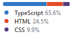
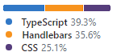

# Contents

 
Table of contents of my github
 

 

<table>
    <tbody>
        <tr><td colspan=3> <h2 style="color:green">▶️ C# language</h2></td></tr>
        <tr>
            <td class="pl-mi2"><b>Application</b></td>
            <td class="pl-mi2"><b>Languages</b></td>
            <td class="pl-mi2"><b>Info</b></td>
        </tr>
        <tr><td colspan=3><h3> <b>Articles:</b>:  Software Development from Low-Level Methods to .NET</h3></td>
        </tr>
        <tr>
            <td>
                <table  border="0">
                    <tr>
                        <td>✅</td>
                        <td>
                        <a href="https://github.com/janluksoft/NET_MemoryLeak"><b>NET_MemoryLeak</b></a>  
                            .NET Memory leaks under C#
                        </td>
                    </tr>
                </table>
            </td>
            <td></td>
            <td></td> 
        </tr>
        <tr>
            <td>
                <table  border="0">
                    <tr>
                        <td>✅</td>
                        <td><a href="https://github.com/janluksoft/NET_CLR_RAM"><b>NET_CLR_RAM</b></a>  
                            .NET Framework CLR dump REM memory
                        </td>
                    </tr>
                </table>
            </td>
            <td></td>
            <td></td> 
        </tr>
        <tr>
            <td>
                <table  border="0">
                    <tr>
                        <td>✅</td>
                        <td><a href="https://github.com/janluksoft/NET_ExecutionModel"><b>NET_ExecutionModel</b></a>  
                            .NET CLR execution model; Two-stage .NET application model
                        </td>
                    </tr>
                </table>
            </td>
            <td></td>
            <td></td>
        </tr>
        <tr>
            <td>
                <table  border="0">
                    <tr>
                        <td>✅</td>
                        <td><a href="https://github.com/janluksoft/NET_Types"><b>NET_Types</b></a>  
                            Data types in .NET (CTS and CLS)
                        </td>
                    </tr>
                </table>
            </td>
            <td></td>
            <td></td>
        </tr>
        <tr>
            <td>
                <table  border="0">
                    <tr>
                        <td>✅</td>
                        <td><a href="https://github.com/janluksoft/NET_architecture"><b>NET_architecture</b></a>  
                        Diagram showing the .NET and ambient architecture
                        </td>
                    </tr>
                </table>
            </td>
            <td></td>
            <td></td>
        </tr>
        <tr>
            <td>
                <table  border="0">
                    <tr>
                        <td>✅</td>
                        <td><a href="https://github.com/janluksoft/InMemory_PE_Format"><b>InMemory_PE_Format</b></a>  
                            High-level language C++ (PE format in RAM)
                        </td>
                    </tr>
                </table>
            </td>
            <td></td>
            <td></td>
        </tr>
        <tr>
            <td>
                <table  border="0">
                    <tr>
                        <td> ✅ </td>
                        <td><a href="https://github.com/janluksoft/InMemory_Assembler"><b>InMemory_Assembler</b></a>  
                            Direct CPU programming - assembler
                        </td>
                    </tr>
                </table>
            </td>
            <td></td>
            <td></td>
        </tr>
        <tr>
            <td>
                <table  border="0">
                    <tr>
                        <td> ✅ </td>
                        <td><a href="https://github.com/janluksoft/InMemory_DigitalCircuits"><b>InMemory_DigitalCircuits</b></a>  
                            Non-programmable digital circuits
                        </td>
                    </tr>
                </table>
            </td>
            <td></td>
            <td></td>
        </tr>
        <tr><td colspan=3> <h2>🔷 C# language</h2></td></tr>
        <tr>
            <td bgcolor="bisque" class="pl-mi2"><b>Application</b></td>
            <td class="pl-mi2"><b>Languages</b></td>
            <td class="pl-mi2"><b>Info</b></td>
        </tr>
        <tr>
            <td>🔷 <a href="https://github.com/janluksoft/NET_ReflectionTypes"><b>NET_ReflectionTypes</b></a>  .NET 8 C# app: Reflection - dynamic manipulation of types and classes </td>
            <td></td>
            <td></td> 
        </tr>
        <tr>
            <td>🔷 <a href="https://github.com/janluksoft/NET_ReflectionAttributes"><b>NET_ReflectionAttributes</b></a>  .NET 8 C# app: Reflection -  Reading attribute class</td>
            <td></td>
            <td></td> 
        </tr>
        <tr>
            <td>🔷 <a href="https://github.com/janluksoft/NET_AsyncEvents"><b>NET_AsyncEvents</b></a>  .NET8 C# app: Events: Publisher - Subscriber asynchronous work.</td>
            <td></td>
            <td></td> 
        </tr>
        <tr>
            <td>🔷 <a href="https://github.com/janluksoft/NET_polymorphism"><b>NET_Polymorphism</b></a>  .NET9 C# app: interfaces, abstract classes, polymorphism, inheritance, tuples.</td>
            <td></td>
            <td></td> 
        </tr>
        <tr>
            <td>🔷 <a href="https://github.com/janluksoft/NET_Inheritance"><b>NET_Inheritance</b></a>  .NET 9 C# app: Multiple class inheritance, property checking.</td>
            <td></td>
            <td></td> 
        </tr>
        <tr>
            <td>🔷 <a href="https://github.com/janluksoft/WinFormDelegate"><b>WinFormDelegate</b></a>  .NET C# app: How Delegates Work</td>
            <td></td>
            <td></td> 
        </tr>
    </tbody>
</table>

 
 

<table>
    <tbody>
        <!-- ======================================================= -->
        <tr><td colspan=3> <h2>ASP.NET Applications</h2></td></tr>
        <tr>
            <td class="pl-mi2"><b>Application</b></td>
            <td class="pl-mi2"><b>Languages</b></td>
            <td class="pl-mi2"><b>Info</b></td>
        </tr>
        <tr>
            <td><a href="https://github.com/janluksoft/AspNetCoreMvc_3EF_Mirabell"><b>AspNetCoreMvc_3EF_Mirabell</b></a>  ASP.NET Core MVC project with EF and MS-SQL database</td>
            <td></td>
            <td></td>
        </tr>
        <tr>
            <td><a href="https://github.com/janluksoft/AspNetCoreMvc_2Layout"><b>AspNetCoreMvc_2Layout</b></a>  Simple website project 2 in ASP.NET Core MVC with Layout</td>
            <td></td>
            <td></td>
        </tr>
        <tr>
            <td><a href="https://github.com/janluksoft/AspNetCoreMvc_1Simplest"><b>AspNetCoreMvc_1Simplest</b></a>  This is the simplest ASP.NET Core MVC project that can be</td>
            <td></td>
            <td></td>
        </tr>
        <tr>
            <td><a href="https://github.com/janluksoft/AspNet_MasterPages_UserControls"><b>AspNet_MasterPages_UserControls</b></a>  ASP.NET WebForm page using the Master-Pages and User-Controls</td>
            <td></td>
            <td></td>
        </tr>
        <tr>
            <td><a href="https://github.com/janluksoft/AspNetRazorLayout"><b>AspNetRazorLayout</b></a>  Create ASP.NET Core Razor Pages using 'Layout.cshtml' pattern </td>
            <td></td>
            <td></td>
        </tr>
        <tr>
            <td><a href="https://github.com/janluksoft/AspNetRazorSimplest"><b>AspNetRazorSimplest</b></a>  The simplest Razor-Pages project that can be</td>
            <td></td>
            <td></td>
        </tr>
        <tr>
            <td><a href="https://github.com/janluksoft/AspNETWebForm"><b>AspNETWebForm</b></a>  A simple ASP.NET application in WebForm technology</td>
            <td></td>
            <td></td>
        </tr>
        <tr>
            <td><a href="https://github.com/janluksoft/HtmlBotstrap"><b>HtmlBotstrap</b></a>  Example menu Html, JavaScript using bootstrap and jquery libraries</td>
            <td></td>
            <td></td>
        </tr>
        <tr>
            <td><a href="https://github.com/janluksoft/"><b></b></a>  </td>
            <td></td>
            <td></td>
        </tr>
        <!-- ========= Azure ========================================== -->
        <tr><td colspan=3> <h2 style="color:green">Azure </h2></td></tr>
        <tr>
            <td class="pl-mi2"><b>Application</b></td>
            <td class="pl-mi2"><b>Languages</b></td>
            <td class="pl-mi2"><b>Info</b></td>
        </tr>
        <tr>
            <td><a href="https://github.com/janluksoft/Azure_OpenAI"><b>Azure_OpenAI</b></a>  AI services available for .NET on Azure</td>
            <td></td>
            <td></td>
        </tr>
        <tr>
            <td><a href="https://github.com/janluksoft/Azure_NetService"><b>Azure_NetService</b></a>  Azure Services available for .NET</td>
            <td></td>
            <td></td>
        </tr>
        <tr>
            <td><a href="https://github.com/janluksoft/Azure_AppService"><b>Azure_AppService</b></a>  Hosting Applications on Azure</td>
            <td></td>
            <td></td>
        </tr>
        <tr>
            <td><a href="https://github.com/janluksoft/Azure_Database"><b>Azure_Database</b></a>  SQL Server and Databases on Azure in PaaS Model</td>
            <td></td>
            <td></td>
        </tr>
        <tr><td colspan=3> </td></tr>
        <!-- ============= Modern ===================================== -->
        <tr><td colspan=3> <h2>Modern web-applications</h2></td></tr>
        <tr>
            <td class="pl-mi2"><b>Application</b></td>
            <td class="pl-mi2"><b>Languages</b></td>
            <td class="pl-mi2"><b>Info</b></td>
        </tr>
        <tr>
            <td><a href="https://github.com/janluksoft/WebApp_Modal_Windows"><b>WebApp_Modal_Windows</b></a>  Nice sliding, colorful modal windows with shadow for use in a web browser</td>
            <td> </td>
            <td></td>
        </tr>
        <tr>
            <td><a href="https://github.com/janluksoft/WebApp_Redux"><b>WebApp_Redux</b></a>  Redux in Web-App - centralized state manager to mediate action transfers</td>
            <td></td>
            <td></td>
        </tr>
        <!-- ============= DevOps ===================================== -->
        <tr><td colspan=3> <h2 style="color:green">DevOps</h2></td></tr>
        <tr>
            <td class="pl-mi2"><b>Application</b></td>
            <td class="pl-mi2"><b>Languages</b></td>
            <td class="pl-mi2"><b>Info</b></td>
        </tr>
        <tr>
            <td><a href="https://github.com/janluksoft/DevOps_Kubertenes_POD"><b>DevOps_Kubertenes_POD</b></a>  Creating Node, POD and containers for web app in Kubertenes </td>
            <td></td>
            <td></td>
        </tr>
        <tr>
            <td><a href="https://github.com/janluksoft/DevOps_Docker_app"><b>DevOps_Docker_app</b></a>  Node web app with image configuration in Docker </td>
            <td></td>
            <td></td>
        </tr>
        <tr><td colspan=3> </td></tr>
        <tr><td colspan=3> <h2 style="color:green">Angular Applications </h2></td></tr>
        <tr>
            <td class="pl-mi2"><b>Application</b></td>
            <td class="pl-mi2"><b>Languages</b></td>
            <td class="pl-mi2"><b>Info</b></td>
        </tr>
        <tr>
            <td><a href="https://github.com/janluksoft/Angular_Components"><b>Angular_Components</b></a>  Web-application with nested Angular components </td>
            <td></td>
            <td></td>
        </tr>
        <tr><td colspan=3> </td></tr>
        <tr><td colspan=3> <h2 style="color:green">Node Applications </h2></td></tr>
        <tr>
            <td class="pl-mi2"><b>Application</b></td>
            <td class="pl-mi2"><b>Languages</b></td>
            <td class="pl-mi2"><b>Info</b></td>
        </tr>
        <tr>
            <td><a href="https://github.com/janluksoft/Node_Express_TS_MsSql"><b>Node_Express_TS_MsSql</b></a>  The Node CRUD MVC app with the Sequelize ORM MsSql framework</td>
            <td> 
            </td>
            <td></td>
        </tr>
        <tr>
            <td><a href="https://github.com/janluksoft/Node_Express_TS_Postgres"><b>Node_Express_TS_Postgres  </b></a>  Node Express TS Postgres </td>
            <td></td>
            <td></td>
        </tr>
        <tr>
            <td><a href="https://github.com/janluksoft/Node_Express_TS_Rest_Api"><b>Node_Express_TS_Rest_Api</b></a>  Node Express TS: Full Rest Api </td>
            <td></td>
            <td></td>
        </tr>
        <tr>
            <td><a href="https://github.com/janluksoft/Node_Express_TS_controllers_async"><b>Node_Express_TS_controllers_async</b></a>  Node TS async: GET, POST method. File: router, controllers, views; </td>
            <td></td>
            <td></td>
        </tr>
        <tr>
            <td><a href="https://github.com/janluksoft/Node_Express_JS_controllers"><b>Node_Express_JS_controllers</b></a>  Node JS: GET, POST method. File division into router, controllers, views; </td>
            <td></td>
            <td></td>
        </tr>
        <tr>
            <td><a href="https://github.com/janluksoft/Node_Express_TS_Pug_table"><b>Node_Express_TS_Pug_table</b></a>  Node Express, TS, Pug engine: app displays a table downloaded from the server</td>
            <td></td>
            <td></td>
        </tr>
        <tr>
            <td><a href="https://github.com/janluksoft/Node_Express_TS_Hbs_table"><b>Node_Express_TS_Hbs_table</b></a>  Node Express, TS, Hbs engine: app displays a table downloaded from the server</td>
            <td></td>
            <td></td>
        </tr>
        <tr>
            <td><a href="https://github.com/janluksoft/Node_Express_TypeScript_starter"><b>Node_Express_TypeScript_starter</b></a>  Starter - basic app/description for creating Node TypeScript</td>
            <td></td>
            <td></td>
        </tr>
        <tr>
            <td><a href="https://github.com/janluksoft/Node_Express_http_server"><b>Node_Express_http_server</b></a>  Node.js: a multipage web app with Express and Hbs</td>
            <td></td>
            <td></td>
        </tr>
        <tr>
            <td><a href="https://github.com/janluksoft/Node_Web_Scraping_adv"><b>Node_Web_Scraping_adv</b></a>  A simple Node scraping application for reading data from websites and generate events </td>
            <td> </td>
            <td></td>
        </tr>
        <tr>
            <td><a href="https://github.com/janluksoft/Node_Web_Scraping"><b>Node_Web_Scraping</b></a>  A simple Node scraping application for reading data from websites</td>
            <td></td>
            <td></td>
        </tr>
        <tr>
            <td><a href="https://github.com/janluksoft/Node_http_server"><b>Node_http_server</b></a>  Node.js: a simple http server without libraries, without Express</td>
            <td></td>
            <td></td>
        </tr>
        <tr><td colspan=3> <h2 style="color:green">React Applications </h2></td></tr>
        <tr>
            <td class="pl-mi2"><b>Application</b></td>
            <td class="pl-mi2"><b>Languages</b></td>
            <td class="pl-mi2"><b>Info</b></td>
        </tr>
        <tr>
            <td><a href="https://github.com/janluksoft/React_Npm_TS_MaterialTable"><b>React_Npm_TS_MaterialTable</b></a>  React element - GridView: nice MaterialReactTable</td>
            <td></td>
            <td></td>
        </tr>            
        <tr>
            <td><a href="https://github.com/janluksoft/React_Npm_TS_NiceClock"><b>React_Npm_TS_NiceClock  </b></a>  React nice analog/digital clock in TypeScript </td>
            <td></td>
            <td></td>
        </tr>
        <tr>
            <td><a href="https://github.com/janluksoft/React_Npm_TS_Techniques"><b>React_Npm_TS_Techniques  </b></a>  React elements with TypeScript </td>
            <td></td>
            <td></td>
        </tr>
        <tr>
            <td><a href="https://github.com/janluksoft/React_Npm_JS_NiceClock"><b>React_Npm_JS_NiceClock  </b></a>  React nice analog/digital clock in </td>
            <td></td>
            <td></td>
        </tr>
        <tr>
            <td><a href="https://github.com/janluksoft/React_Html_DataGrid"><b>React_Html_DataGrid</b></a>  Using an external React element: DataGrid with pagination</td>
            <td></td>
            <td></td>
        </tr>
        <tr>
            <td><a href="https://github.com/janluksoft/React_Html_OneFile"><b>React_Html_OneFile</b></a>  Simple React elements in one .html file</td>
            <td></td>
            <td></td>
        </tr>
        <tr>
            <td><a href="https://github.com/janluksoft/React_Html_JSXfile"><b>React_Html_JSXfile</b></a>  Fixed the issue of including js files containing JSX syntax</td>
            <td></td>
            <td></td>
        </tr>
        <tr>
            <td><a href="https://github.com/janluksoft/React_Html_4Elements"><b>React_Html_4Elements</b></a>  Defined React element used in several places in the html</td>
            <td></td>
            <td></td>
        </tr>
    </tbody>
</table>

## DataBase application

[**TSqlPivot**](https://github.com/janluksoft/TSqlPivot)	An example of a complex T-SQL query

[**WPFCore6EFSql**](https://github.com/janluksoft/WPFCore6EFSql)		WPF Core .NET6: Entity Framework application for CRUD operations on Microsoft SQL Server 	

[**WPFCore5EFSql**](https://github.com/janluksoft/WPFCore5EFSql)	WPF Core .NET5: Entity Framework application for CRUD operations on Microsoft SQL Server

[**EFPostgresWinForm**](https://github.com/janluksoft/EFPostgresWinForm)	Entity Framework application for CRUD operations on Postgres Server 	

[**EFSqlServerWinForm**](https://github.com/janluksoft/EFSqlServerWinForm)	Entity Framework application for CRUD operations on Microsoft SQL Server 

## WPF window

[**WPFCoreNiceWin**](https://github.com/janluksoft/WPFCoreNiceWin)	Nice WPF windows with dynamic themes changing

[**WpfMvvmBarCharts**](https://github.com/janluksoft/WpfMvvmBarCharts)	A WPF application with MVVM pattern with a bar charts and RelayCommands

[**WpfMvvmBarChart**](https://github.com/janluksoft/WpfMvvmBarChart)		A simple WPF application with MVVM pattern with a bar chart 

## Other topics

[**NET_architecture**](https://github.com/janluksoft/NET_architecture)		My diagram showing the .NET and ambient architecture

[**GIT_UseCases**](https://github.com/janluksoft/GIT_UseCases)		 My diagram showing the use cases of common operations in the GIT environment 

[**WinFormDelegate**](https://github.com/janluksoft/WinFormDelegate)		The project shows how the 'delegate' mechanism works 

[**VisualStudio2019Setup**](https://github.com/janluksoft/VisualStudio2019Setup)	Visual Studio 2019 setup colors	

